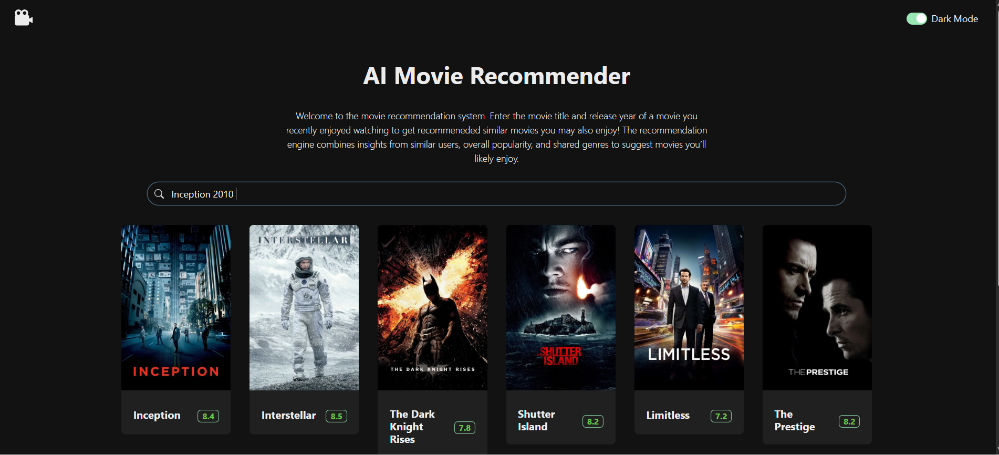

# 🎬 AI Movie Recommender

An AI-powered movie recommendation system with a **React (TypeScript) frontend** and a **FastAPI (Python) backend**.  
This project combines traditional filtering with a **ai based recommendation algorithm** to deliver personalized movie suggestions.

---

## Recommendation Webpage

- Website Link: https://movie-store-lovat.vercel.app/recommend

---

## Features

1. **Movie Search & Filtering**

   - Search movies by title, genre, and rating.
   - Retrieves detailed movie information using the TMDb API.

2. **AI-Powered Recommendations**

   - Enter a movie you’ve watched and liked → receive **8 recommended movies** ranked by similarity score.
   - Recommendations are **precomputed** for 5000 of the most popular movies (1995–2020).
   - Built on a **hybrid recommendation algorithm** that leverages both **content-based filtering** and **collaborative filtering**.

3. **Backend Intelligence**
   - Uses the **MovieLens dataset** to extract metadata and ratings.
   - Built with **scikit-learn, NumPy, and pandas** for machine learning and data processing.

---

## How the AI Recommendation Engine Works

The recommendation system is based on a **hybrid AI model**:

- **Content-Based Filtering**  
  Feature extraction: Each movie’s title and genres are combined into a single string (e.g., "Toy Story Animation Children").
  Vectorization: The text is transformed into numerical features using TF-IDF (Term Frequency–Inverse Document Frequency), which highlights important words while ignoring common ones.
  Similarity calculation: A cosine similarity matrix compares every pair of movies. Movies with higher similarity scores are considered more alike.
  Ranking: For a given movie, the system selects the top N most similar movies as recommendations.

- **Collaborative Filtering**  
  Uses user rating patterns from the MovieLens dataset to enhance personalization.

- **Hybrid Approach**  
  Both methods are combined:
  - Content similarity ensures the recommendations make contextual sense.
  - Collaborative filtering ensures the recommendations reflect collective audience preferences.

This combination produces a more **accurate and personalized recommendation** than using either method alone.

---

## Tech Stack

- **Frontend:** React (TypeScript), Vercel Deployment
- **Backend:** FastAPI (Python), Render Deployment
- **Libraries:** scikit-learn, NumPy, pandas
- **Data Sources:** MovieLens dataset (backend), TMDb API (frontend)

---

## Future Improvements

- Expand dataset beyond 5000 movies.
- Add user login + personalized recommendations.
- Improve ranking by analyzing sematic similarities from movie descriptions by using LLMs like ollama or Openai

---
